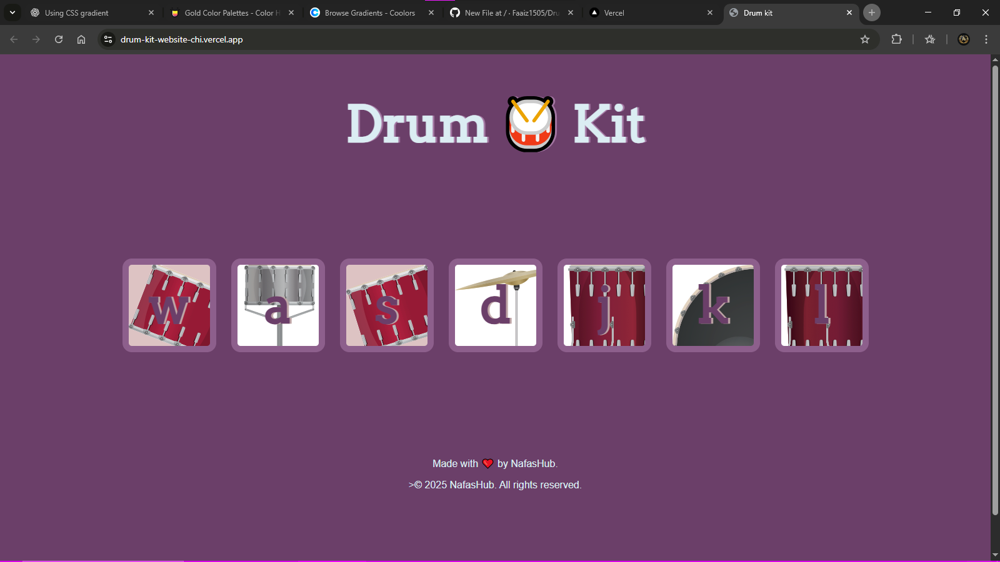

# 🥁 Drum Kit Website

[](https://developer.mozilla.org/en-US/docs/Web/HTML)  
[](https://developer.mozilla.org/en-US/docs/Web/CSS)  
[](https://developer.mozilla.org/en-US/docs/Web/JavaScript)  
[](https://drum-kit-website-pgq2v6ed7-nasirudeen-faaiz-s-projects.vercel.app )

A simple and fun **Drum Kit web app** built with **HTML, CSS, and JavaScript**.  
Press the keys on your keyboard or click the drum buttons to play different drum sounds in real-time.

---

## 🚀 Features
- Play drum sounds with mouse clicks or keyboard keys.
- Responsive layout for desktop and mobile.
- Smooth CSS styling for an engaging UI.
- Lightweight and beginner-friendly project.

---

## 🛠️ Built With
- **HTML5** – Structure of the web app.
- **CSS3** – Styling and layout.
- **JavaScript (ES6)** – Functionality and sound logic.

---

## 🎮 How to Use
1. Open the website in your browser.
2. Click any drum button **OR** press the corresponding keyboard key.
3. Enjoy making beats!

---

## 📸 Preview


---

## 📂 Project Setup
Clone this repository and open `index.html` in your browser:

```bash
git clone https://github.com/Faaiz1505/Drumkit-website.git
cd drum-kit

git clone https://github.com/your-username/drum-kit.git
cd drum-kit
